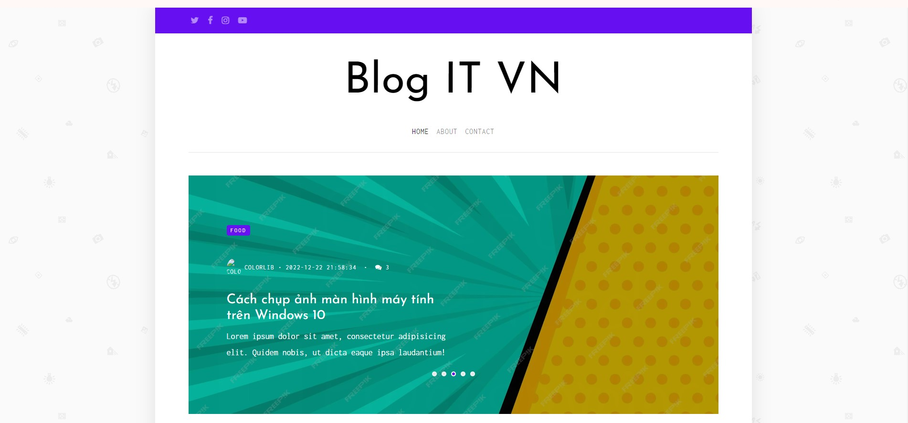
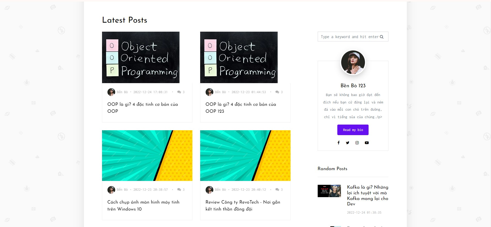
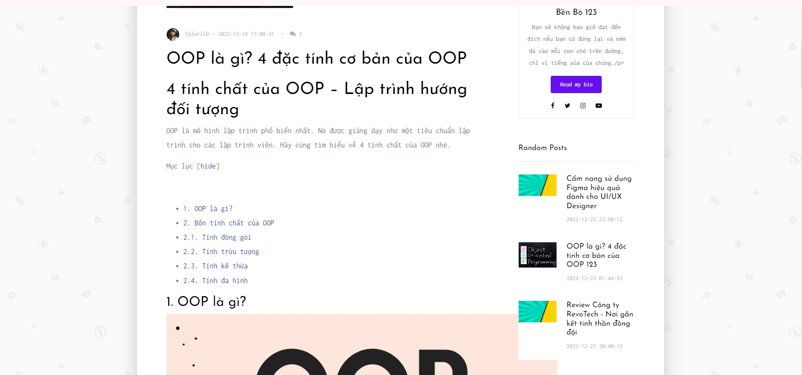
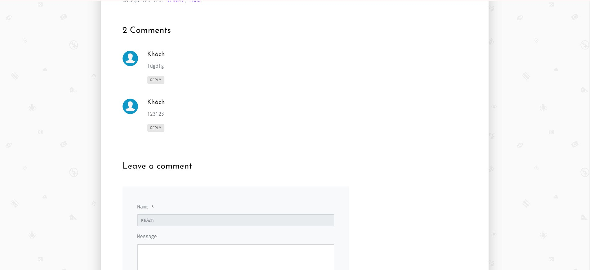
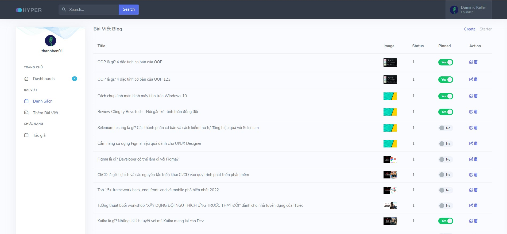
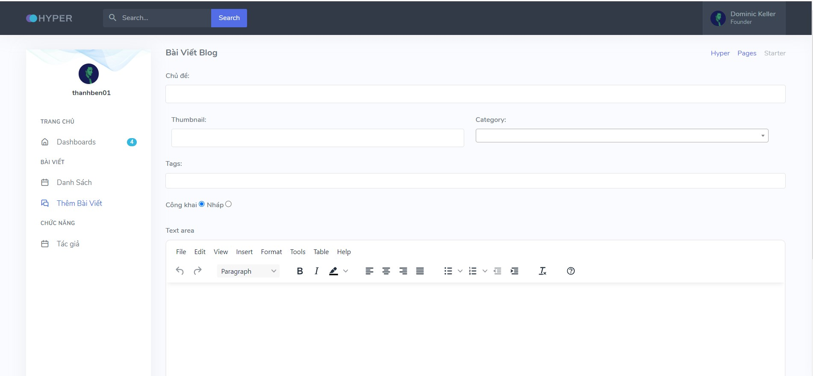

# Personal Blog.

## About this Project:

A personal blog is a website where an individual shares their thoughts, experiences, and ideas with the world. It is a great way to connect with others, share your passions, and build a community.
Connect with me at:

    
  &nbsp;&nbsp;
  

  📫 How to reach me: <a href='mailto:nben19732@gmail.com'>nben19732@gmail.com</a>

## Technology Used:
- PHP
- Mysql
- Ajax/JQuery

## Features
- View post
- Comment post
- Search post
- New post (only admin)
- Admin authentication
- System statistics
 
## Screen 

